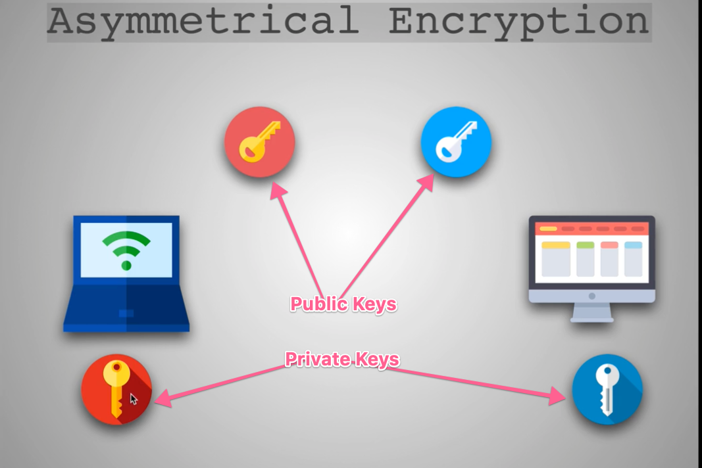
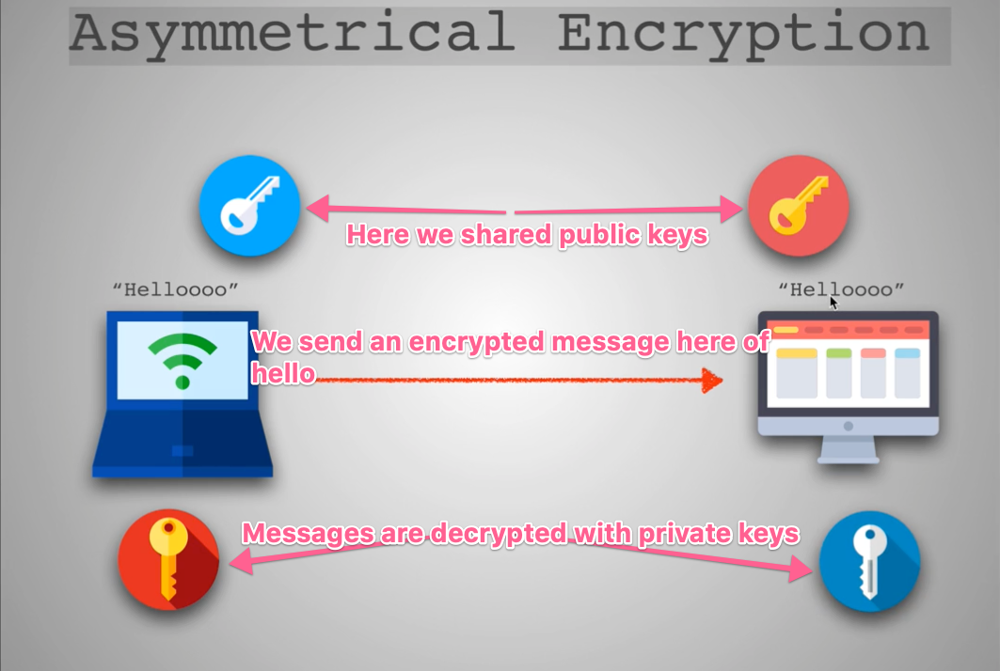

# Junior to Senior Web Developer

## SSH
SSH or Secure Shell Protocol is a to use or terminal to communicate with a operating system remotely

`ssh {user}@host` is the format that we use to connect via SSH

### Symmetrical Encryption
One secret key encryption and decryption. So one key to rule them all! This would look like:

`"Hello" => "EY#*@#@)I" => "Hello"`

So we have text from our machine and our key that is shared with another user thereby giving a way for the other user to decrypt our "Hello" text.

We never actual pass the key which is how this process stays safe. This is done through the Key Exchange Algorithm. This is generated each new session

### Asymmetrical encryption
We have public keys and private keys and the same goes for the entity that we are sharing information with. Your private key can not mathematically compute your public key. Another way of saying this is a message that is encrypted with your public key can only be decrypted by that same machines' private key.

SSH is not entirely asymmetrical encryption, it's not. This level of asymmetrical encryption is only done during key exchange. As we begin a session temp keys are exchanged between you and a host until actual keys are exchanged. This process of key exchange is done through what is called the Diffie Hellman Key exchange. This is done with a bit of the public key, private keys and your machine to create that Symmetrical key that is initially exchanged. Let me be clear and say the exchange is done on your local machine it is not being sent across the wire.

Key Exchange Algorithm Resources
- https://www.youtube.com/watch?v=NmM9HA2MQGI
- https://www.youtube.com/watch?v=Yjrfm_oRO0w
- https://www.youtube.com/watch?v=vsXMMT2CqqE&t=
- https://www.youtube.com/watch?v=NF1pwjL9-DE

In the previous video I showed you how to add SSH keys to the authorized_keys of a Digital Ocean Server. Afterwards, I also showed you how to add it on the Digital Ocean control panel. Keep in mind that you cannot, use the control panel in Digital Ocean to add keys to already created droplets. You either have to create a new server after you've added the SSH key on the control panel, or add it manually to the authorized_keys

Also, if you are on Windows, you may have to use GitBash instead of Powershell. Here are the steps that a fellow student followed:

1. Download, install and open Git Bash - the link is provided at the end of the video.

2. Type "ssh-agent bash" and press Enter.

3. Type "ssh-add ~/.ssh/id_rsa_digitalocean" and press Enter. You should get confrimation of Identity added.

4. Try connecting to your digital ocean account again via SSH. Now it shouldn't ask you for the password!

### Recommended ssh-keygen command:

`ssh-keygen -t rsa -b 4096 -C "your_email@example.com"`

Windows:

If you have Git for Windows (which you should), ssh-keygen command should be available: https://gitforwindows.org/

You can read more about this [here](https://stackoverflow.com/questions/11771378/ssh-keygen-is-not-recognized-as-an-internal-or-external-command)

Another option is to use https://www.ssh.com/ssh/putty/windows/puttygen

`pbcopy`: https://superuser.com/questions/472598/pbcopy-for-windows/1171448#1171448

Extra Video:

If you want to learn a little bit more about how SSH works internally, watch this excellent video: https://youtu.be/ORcvSkgdA58